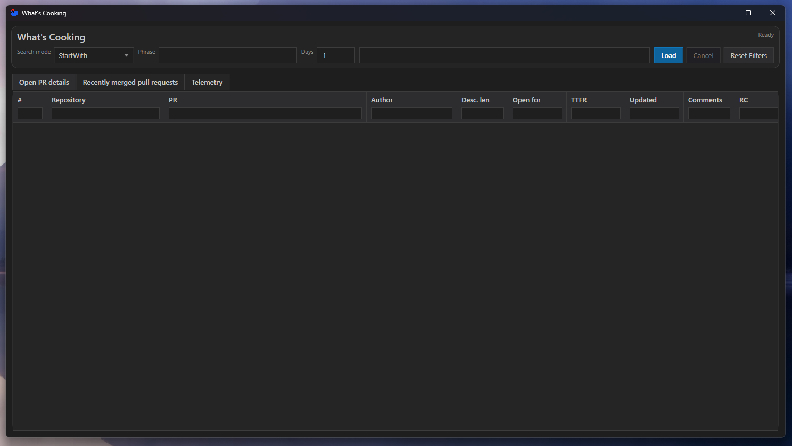
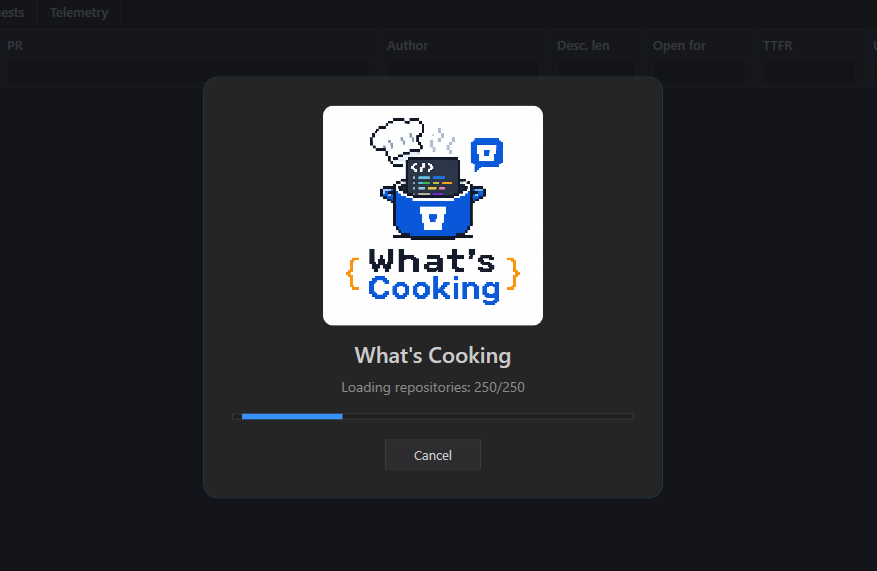
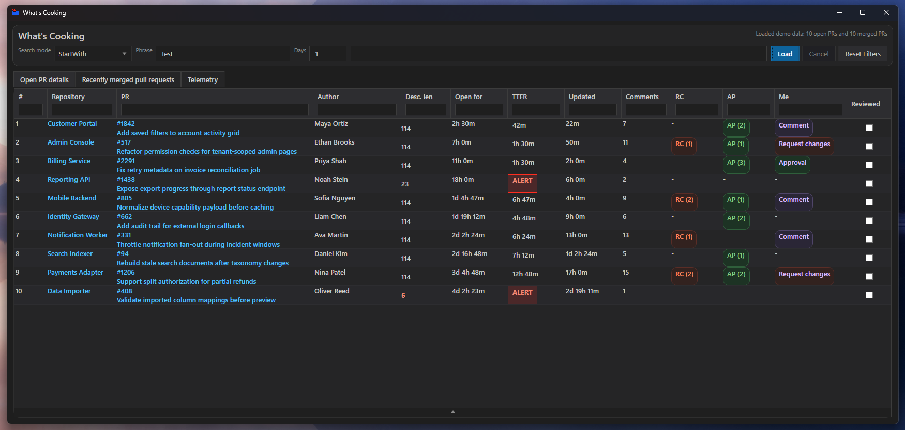
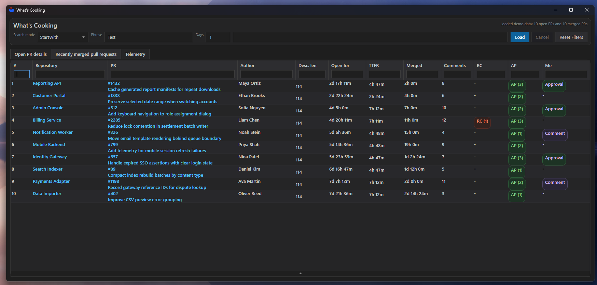
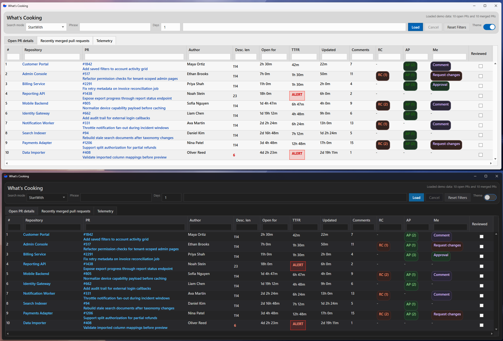

# What's Cooking

<p align="center">
  
</p>

What's Cooking is a WPF desktop application for reviewing Bitbucket pull requests across a filtered set of repositories.

This project is a logical continuation of my CLI/reporting project [ntulenev/BBRepoList](https://github.com/ntulenev/BBRepoList). The original tool collected Bitbucket repository and pull request data and generated HTML reports. What's Cooking keeps the Bitbucket data-loading core, but moves the daily PR review workflow into an interactive desktop UI.

## Features

- Filter repositories by `StartWith` or `Contains`.
- Choose the period for recently merged pull requests directly in the UI.
- View open pull requests and recently merged pull requests in separate tabs.
- Use global search, per-column filters, column sorting, and one-click filter reset.
- Use `Fit` to resize the current table columns once to the available window width, then adjust them manually if needed.
- Remember the repository search mode and phrase after pressing `Load`.
- Switch between the default dark theme and a light theme; the selected theme is remembered between launches.
- Adjust UI scale with `Ctrl +` and `Ctrl -`; the selected scale is remembered between launches.
- Open repositories and pull requests in Bitbucket from the table.
- Mark pull requests as reviewed to visually de-emphasize them.
- Use `Hide reviewed` in the `Reviewed` column to remove reviewed pull requests from the current table, then use `Show all` to display them again.
- Copy a ready-to-use AI review prompt for an open pull request, including its Bitbucket URL, metadata, description, detected Jira issue key, and API access details.
- Cache open and merged pull request activity summaries to avoid reloading unchanged `/activity` data from Bitbucket.
- Track per-load Bitbucket API requests, pull request activity cache efficiency, and current cache size in a dedicated telemetry tab.
- Run the UI with synthetic demo data when Bitbucket credentials are not available.
- Show repository-scanning progress while data is being loaded and allow an active load to be cancelled.

## Screenshots

The screenshots below use synthetic data generated by `DemoMode`. Repository names, pull requests, authors, review states, and telemetry values are demo-only and are not connected to real projects or people.







## Project Structure

- `BBRepoList` - core library for Bitbucket API access, pull request loading, caching, telemetry, models, and registrations.
- `WhatsCooking.Presentation` - dashboard use cases, view models, UI-facing services, and filtering logic.
- `WhatsCooking.Infrastructure` - desktop infrastructure services such as clipboard access and user preferences.
- `WhatsCooking` - WPF application, views, resources, and runtime configuration.
- `AI_REVIEW_PROMPT.md` - English prompt template used by the `Copy` action in the open pull request table.

## Configuration

Runtime settings are stored in:

```text
WhatsCooking/appsettings.json
```

Infrastructure, loading behavior, and advanced UI tuning are configured in `appsettings.json`. Repository filter mode, filter phrase, merged PR period, table filters, UI theme, and UI scale are controlled from the UI.

The selected UI theme, UI scale, repository search mode, and repository search phrase are stored per user in:

```text
%LocalAppData%\WhatsCooking\preferences.json
```

### Bitbucket

| Setting | Description |
| --- | --- |
| `Bitbucket:DemoMode` | When `true`, `Load` fills all tabs with synthetic demo data and does not call Bitbucket. Defaults to `false`. |
| `Bitbucket:BaseUrl` | Bitbucket API base URL. Usually `https://api.bitbucket.org/2.0`. |
| `Bitbucket:Workspace` | Bitbucket workspace key used to query repositories and build browser links. |
| `Bitbucket:AuthEmail` | Bitbucket account email used for API authentication. |
| `Bitbucket:AuthApiToken` | Bitbucket API token or app password. Do not commit a real token. |
| `Bitbucket:PageLen` | Bitbucket page size for paged API requests. Valid range is `1..100`. |
| `Bitbucket:RetryCount` | Number of retries for transient Bitbucket API failures. |

When `Bitbucket:DemoMode` is `false`, `Workspace`, `AuthEmail`, and `AuthApiToken` are required. When `DemoMode` is `true`, those values can be left empty. This is intended for demos and screenshots where the UI should look realistic without exposing real Bitbucket projects, pull requests, or people.

### Telemetry

| Setting | Description |
| --- | --- |
| `Bitbucket:Telemetry:Enabled` | Enables per-load Bitbucket API request and pull request activity cache telemetry. The summary and endpoint breakdown are shown in the `Telemetry` tab. |

Telemetry counters are reset every time `Load` starts, so the tab describes the current load rather than a cumulative application-lifetime total.

`Activity cached` is the number of PR activity summaries reused from the local cache. `Activity API loads` is the number of PRs for which the `/activity` endpoint had to be loaded. `Activity cache rate` is calculated from those two values. The application still requests lightweight PR metadata to discover pull requests and validate cached fingerprints; a cache hit avoids loading the more expensive activity history, not all Bitbucket API calls.

The telemetry tab also shows the current pull request details cache size. Use `Clear cache` to delete the persisted cache after confirming the action in the popup dialog.

### UI

| Setting | Description |
| --- | --- |
| `Ui:HorizontalScrollWheelMultiplier` | Multiplier for horizontal table scrolling with `Shift` + mouse wheel. Values below `1.0` make scrolling less sensitive; values above `1.0` make it faster. |

### Pull Request Activity Cache

Activity-derived values such as first response, last activity, discussion participation, and comment count are stored separately for open and merged pull requests under:

```text
<application directory>\cache\pull-request-details
```

On later loads, a cached summary is reused when the PR fingerprint still matches the current Bitbucket metadata. Otherwise, the application reloads `/activity` and refreshes the cache entry. This is especially effective for merged pull requests, which rarely change after merging.

The cache contains derived PR activity data but no Bitbucket API credentials. It can be deleted safely to force activity data to be loaded again. The telemetry tab provides a `Clear cache` button for this, and the displayed cache size is refreshed after clearing.

### AI Review Prompt

The open pull request table contains an `AI review` column with a `Copy` button. It builds an English review prompt from `AI_REVIEW_PROMPT.md` and places it in the clipboard. The generated prompt includes:

- the pull request URL, repository, ID, title, author, creation time, and description;
- a Jira issue key detected in the PR title or description, when present;
- the configured Bitbucket API base URL, workspace, account email, and API token;
- instructions to compare the complete PR diff with its destination branch, check the linked Jira issue, assess scope alignment, and report actionable findings and test gaps.

`AI_REVIEW_PROMPT.md` itself does not contain credentials. It is copied next to the executable during build, and its placeholders are populated only when `Copy` is pressed.

> **Security warning:** the clipboard text contains the configured `Bitbucket:AuthEmail` and `Bitbucket:AuthApiToken`. Paste it only into AI tools and environments you trust. The instruction inside the prompt not to repeat the credentials is not a security boundary. Use a scoped, revocable token and rotate it if the prompt is exposed.

### Pull Request Details

| Setting | Description |
| --- | --- |
| `Bitbucket:PullRequestDetails:TtfrThresholdHours` | Threshold for time-to-first-response highlighting. |
| `Bitbucket:PullRequestDetails:MinimalDescriptionTextLength` | Minimal PR description length expected by the report. Shorter descriptions are marked in the UI. |
| `Bitbucket:PullRequestDetails:LoadThreshold` | Maximum number of repositories loaded in parallel when collecting open PR details. |

### Merged Pull Requests

| Setting | Description |
| --- | --- |
| `Bitbucket:MergedPullRequests:LoadThreshold` | Maximum number of repositories loaded in parallel when collecting recently merged PRs. |

Example shape:

```json
{
  "Bitbucket": {
    "DemoMode": false,
    "BaseUrl": "https://api.bitbucket.org/2.0",
    "Workspace": "your-workspace",
    "AuthEmail": "name@example.com",
    "AuthApiToken": "<secret>",
    "PageLen": 50,
    "RetryCount": 2,
    "Telemetry": {
      "Enabled": true
    },
    "PullRequestDetails": {
      "TtfrThresholdHours": 4,
      "MinimalDescriptionTextLength": 10,
      "LoadThreshold": 4
    },
    "MergedPullRequests": {
      "LoadThreshold": 4
    }
  }
}
```

## Build

```powershell
dotnet build .\WhatsCooking.slnx
```

## Run

```powershell
dotnet run --project .\WhatsCooking\WhatsCooking.csproj
```
